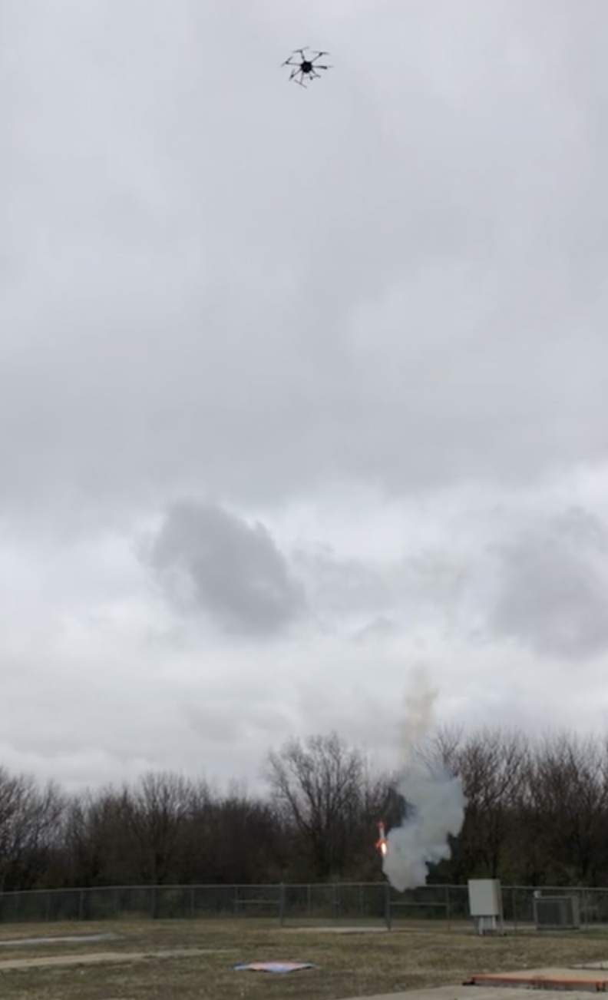
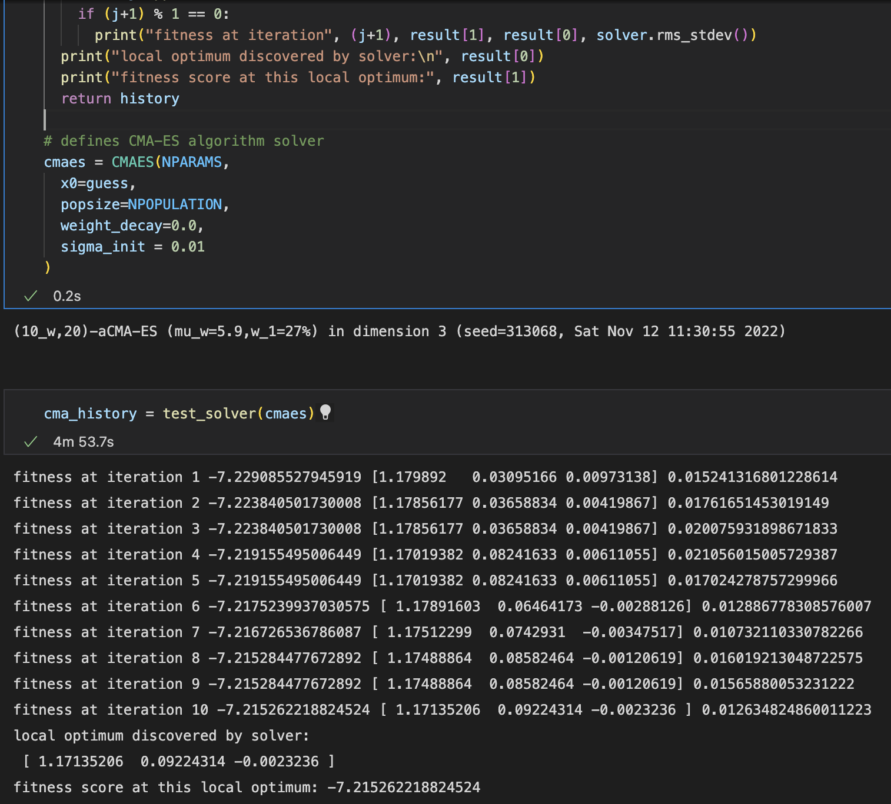
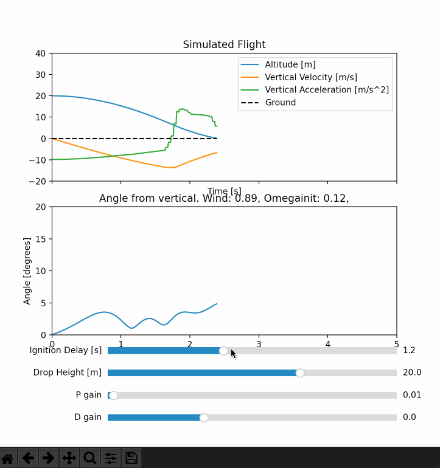

# UIUC Vertically Landed Rocket Challenge 2022

We added a slider to the flight sim in order to get a feel of how each value (ignition delay, Kp, and Kd) changes the flight for randomized wind and initial angular velocity, and used it to get a ballpark estimate of the values.

Then we used a CMA-ES (Covariance-Matrix Adaptation Evolution Strategy) python library to optimize this initial guess. The algorithm tries 20 combinations of the 3 parameters close to the previous guess, picks the best, then picks 20 more to try that are close to the new best guess. If the variance of the scores of the last 20 tries is large, then the next 20 guesses are allowed to be farther away from the best guess. This way, the algorithm spreads out for a broader search when needed. To determine how "good" a combination of values is, it simulated 20 times at random wind and initial conditions and we define the cost = average_landing_speed + 10*average_landing_angle. So, we look for a combination that has the lowest possible cost number to minimize landing speed and angle. After computing 10 iterations (4000 simulations) for 5 minutes, the program usually converges around:

Ignition delay = 1.17±0.01

Kp = 0.05±0.03

Kd = 0.002±0.004

[Optimizer code here](https://github.com/qwertpas/FlightSim/blob/master/vlr_cma.ipynb)

We ended up using an ignition delay of 0.67s because we saw that the demo fired around 0.5s after the simulation said it would, and 1.17-0.5=0.67.
It's hard to tell if this approach actually gives better results than tuning manually, but it was definitely fun to try :)

Run FlightSimMain.py for adjusting drop height and ignition time, FlightSimMain_old.py is the original

